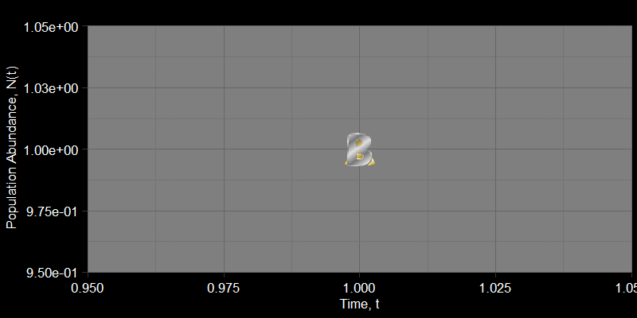

```{r setup, include=FALSE}
knitr::opts_chunk$set(warning = FALSE, message = FALSE) 
#library(webexercises)
library(ggplot2)
library(webexercises)
```

# Introduction

<details>

<summary>Course motivation</summary>

</details>

# Density-independent growth

<details>

<summary>On the nature of growth</summary>

Why did we feel the need to perform lockdowns during the COVID19 pandemic? What do we fear when an "exotic" species is introduced to an ecosystem? There are several answers to these questions, but many of our worries could be summarized by a simple phenomenon: *exponential growth* (or *geometric growth*, which is essentially the same thing). Put simply, geometric and exponential growth refer to when a population grows unbounded, always increasing at a rate proportional to its population size.

## The nature of exponential growth
Text

### Parakeet Invasion
Text

### COVID-19 in New York City
Text

## Growth in variable environments

::: {.webex-check .webex-box}
```{r, results='asis', echo = FALSE}
opts <-   c(answer="Population A","Population B")
Question <- 
"Consider two populations, each starting with one individual. These populations live in a seasonal environment, with a “good” season and a “bad” season occuring every year. A biological example may be a wet and dry season. Population A is unaffected by seasons and grows with the same λ each season:  λ(A,Good) = λ(A,Bad) = 1.2 each season. Thus, each season, each individual in population A produces 1.2 offspring during their lifespan. Population B grows differently depending on the season, where λ(B,Good) = 1.35 each good season and λ(B,Bad) = 1 each bad season. Which population will grow faster? Justify your answer before checking."

cat(Question, longmcq(opts))
```
:::

::: {.callout-note collapse="true" icon="false"}
## Explanation

Many students are inclined to guess population B. However, a quick simulation shows this is not the case:



In my experience, this is because students compare the average values of $\lambda$ for each population. $\frac{\lambda(A,\text{Good})+\lambda(A,\text{Bad})}{2}=\frac{2+2}{2}=2$ while $\frac{\lambda(B,\text{Good})+\lambda(B,\text{Bad})}{2}=\frac{3.8+1}{2}=2.4$. Crucially, this is a comparison of the *arithmetic* means,
:::

</details>

# Density-dependent growth

<details>

Populations cannot grow forever. In principle, this is because population growth requires resources.

<summary>What limits population growth?</summary>

## Logistic growth

Most

However, I find that it is often presented uncritically.

</details>

------------------------------------------------------------------------
