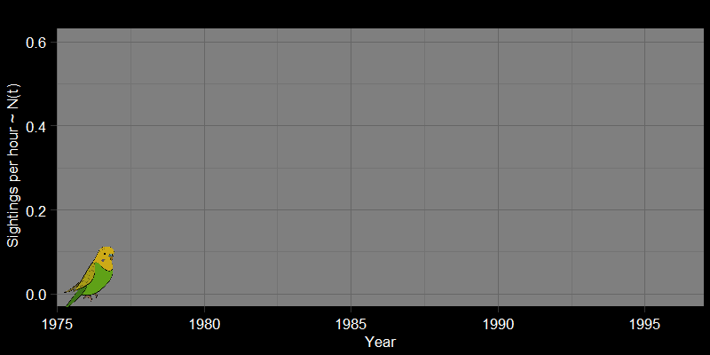

```{r setup, include=FALSE}
knitr::opts_chunk$set(warning = FALSE, message = FALSE) 
#library(webexercises)
library(ggplot2)
library(webexercises)
```

# Introduction

<details>

<summary>Course motivation</summary>
Words

</details>

# The basics of modeling a population

<details>

<summary>The role of mathematics in ecology</summary>

In the most general sense, 

$$
\underbrace{N_{t+1}}_{\text{Abundance at next time step}} =
\underbrace{N_{t}}_{\text{Abundance at previous time step}}  +
\underbrace{\underbrace{B}_{\text{Total number of births}} - 
\underbrace{D}_{\text{Total number of deaths}}}_{\text{Within-population processes}} +
\underbrace{\underbrace{I}_{\text{Total number of immigrants}} - 
\underbrace{E}_{\text{Total number of emmigrants}}}_{\text{External population processes}} +
$$
Words

</details>

# Density-independent growth

<details>

<summary>On the nature of growth</summary>

Why did we feel the need to perform lockdowns during the COVID19 pandemic? What do we fear when an "exotic" species is introduced to an ecosystem? There are several answers to these questions, but many of our worries could be summarized by a simple phenomenon: *exponential growth* (or *geometric growth*, which is essentially the same thing). Put simply, geometric and exponential growth refer to when a population grows unbounded, always increasing at a rate proportional to its population size. We often call this "density-independent" growth because the  

## The nature of exponential growth
Text

$$
\underbrace{N_{t+1}}_{\text{Abundance at next time step}} =
\underbrace{N_{t}}_{\text{Abundance at previous time step}}  +
\underbrace{B}_{\text{Total number of births}} - 
\underbrace{D}_{\text{Total number of deaths}} 
$$


### Parakeet Invasion
Text


### COVID-19 in New York City
Text

## Growth in variable environments

::: {.webex-check .webex-box}
```{r, results='asis', echo = FALSE}
opts <-   c(answer="Population A","Population B")
Question <- 
"Consider two populations, each starting with one individual. These populations live in a seasonal environment, with a “good” season and a “bad” season occuring every year. A biological example may be a wet and dry season. Population A is unaffected by seasons and grows with the same λ each season:  λ(A,Good) = λ(A,Bad) = 1.5 each season. Population B grows differently depending on the season, where λ(B,Good) = 10 each good season and λ(B,Bad) = .2 each bad season. Which population will grow faster? Justify your answer before checking."

cat(Question, longmcq(opts))
```
:::

::: {.callout-note collapse="true" icon="false"}
## Explanation

Many students are inclined to guess population B. However, a quick simulation shows this is not the case:


How should we think about this? Why exactly does population A grow faster? 

In my experience, many students initially think population B grows faster. I think this because students compare the average values of $\lambda$ for each population. For A, the average is: $\frac{\lambda(A,\text{Good})+\lambda(A,\text{Bad})}{2}=\frac{1.5+1.5}{2}=2.25$. For B, the average is $\frac{\lambda(B,\text{Good})+\lambda(B,\text{Bad})}{2}=\frac{10+0.5}{2}=5.25$. Since $5.25 > 2.25$, it seems reasonable to conclude that population B will grow faster. Where did this go wrong? 

The above analysis gives the *arithmetic* means of $\lambda$ for each population. This is the type of average you might be used to:  you take the sum of elements and divide by the number of elements, or 
$$
\overline{\lambda} = \sum_{k=0}^t\lambda_k 
$$
But let's think about how our population grows. As we noted earlier, 
$$
N_t = N_0 \times \lambda^t
$$
blah blah
Over the long-run, the geometric mean is given by: 
$$
\left(\prod_{k=0}^t \lambda_k\right)^{\frac{1}{t}} = \sqrt[t]{\lambda_0 \lambda_1 \cdots\lambda_t}
$$
End it here. 
:::

### Follow-up question
::: {.webex-check .webex-box}
```{r, results='asis', echo = FALSE}
opts <-   c("Population A",answer="Population B")
Question <- 
"Consider two populations, each starting with one individual. These populations live in a seasonal environment, with a “good” season and a “bad” season occuring every year. A biological example may be a wet and dry season. Population A is unaffected by seasons and grows with the same intrinsic growth rate, r,  each season:  r(A,Good) = r(A,Bad) = 0.15 throughout season. Population B grows differently depending on the season, where r(B,Good) = 0.10 each good season and r(B,Bad) = .02 each bad season. Which population will grow faster? Justify your answer before checking."

cat(Question, longmcq(opts))
```
:::

::: {.callout-note collapse="true" icon="false"}
## Explanation 

More words. 
:::


</details>

# Density-dependent growth

<details>

Populations cannot grow forever. In principle, this is because population growth requires resources.

<summary>What limits population growth?</summary>

## Logistic growth

Most

However, I find that it is often presented uncritically.


## The density wars: 

<summary>"[a] long-running verbal debate, reminiscent of medieval scholasticism"/summary>

Thus, the real crux of the question wasn't

Populations fluctuate. In contrast to a model such as the 

More along the lines of "is *most* population change we see attributable to some kind of density-dependent factor? Or (in essence), does most population change reflect randomness and $r$ changing through time?".  


### The logistic map: the end of the debate 
In my view, the debate wasn't *completely* resolved, but the  

</details>


# Predator-prey interactions 

<details>

<summary> Cool quote yay </summary>
## Introduction

We begin today with a riddle that gives some surprising insights into the history of theory ecology: 

<p style="text-align:center;">*What do sharks and machine guns have in common?*</p>

Words 

</details>


------------------------------------------------------------------------
